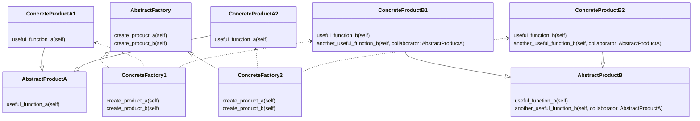

```mermaid
classDiagram
direction BT
class AbstractFactory {
   create_product_a(self) 
   create_product_b(self) 
}
class AbstractProductA {
   useful_function_a(self) 
}
class AbstractProductB {
   useful_function_b(self) 
   another_useful_function_b(self, collaborator: AbstractProductA) 
}
class ConcreteFactory1 {
   create_product_a(self) 
   create_product_b(self) 
}
class ConcreteFactory2 {
   create_product_a(self) 
   create_product_b(self) 
}
class ConcreteProductA1 {
   useful_function_a(self) 
}
class ConcreteProductA2 {
   useful_function_a(self) 
}
class ConcreteProductB1 {
   useful_function_b(self) 
   another_useful_function_b(self, collaborator: AbstractProductA) 
}
class ConcreteProductB2 {
   useful_function_b(self) 
   another_useful_function_b(self, collaborator: AbstractProductA) 
}

ConcreteFactory1 ..|> AbstractFactory
ConcreteFactory2 ..|> AbstractFactory

ConcreteFactory1 ..> ConcreteProductA1
ConcreteFactory1 ..> ConcreteProductB1

ConcreteFactory2 ..> ConcreteProductA2
ConcreteFactory2 ..> ConcreteProductB2

AbstractProductA <|-- ConcreteProductA1
AbstractProductA <|-- ConcreteProductA2

AbstractProductB <|-- ConcreteProductB1
AbstractProductB <|-- ConcreteProductB2
```